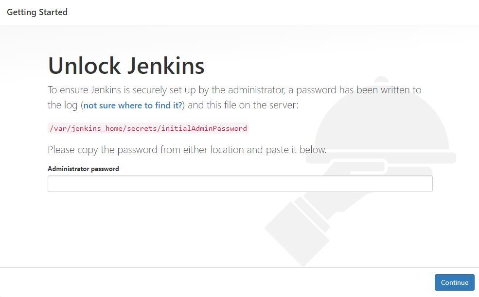
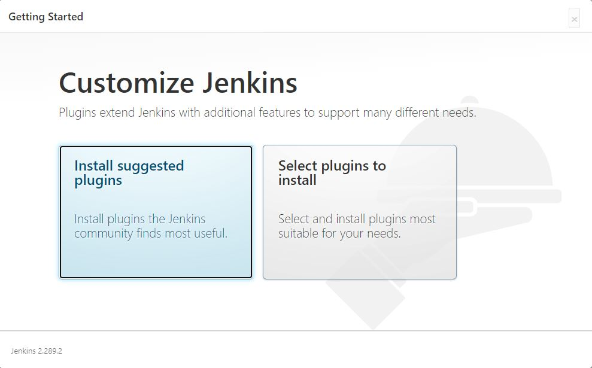
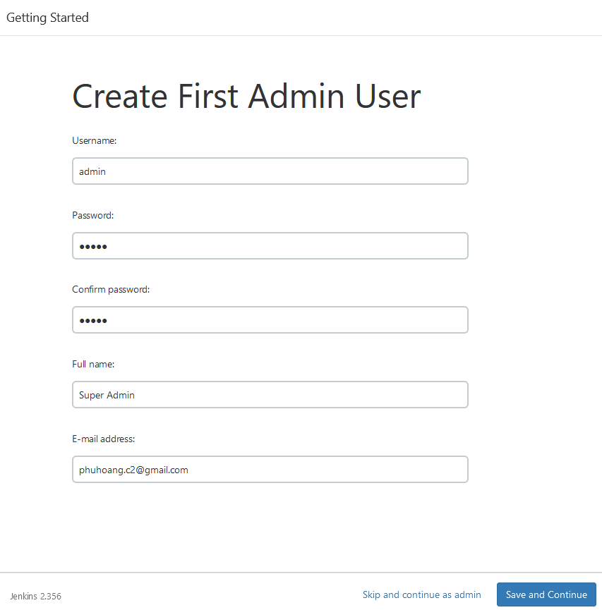
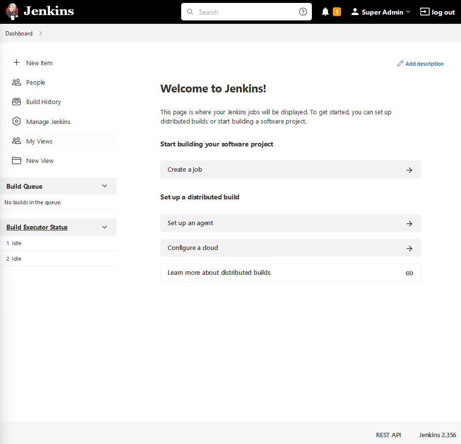
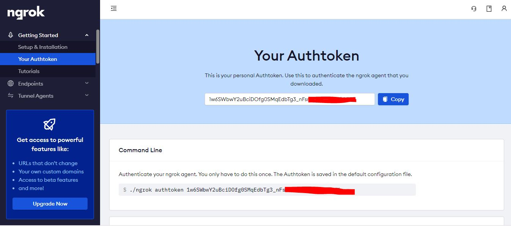
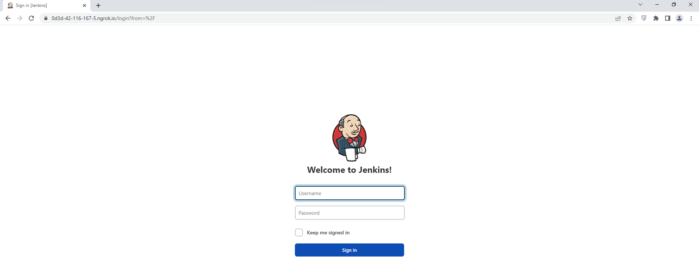

# Jenkins Installation

## Task #1  

Trong task này, bạn được cài đặt Jenkins Server trên Docker, bên trong Jenkins Server này có cài đặt Docker client.

## Prequisites  

| Yêu cầu |  Version|  
|--|--|  
| OS | Ubuntu 18.04 |  
| Tài khoản github.com | N/A |  
| Docker| latest |  
  
## 1. Cài đặt Jenkins Server

### 1.1.  Fork Github Jenkins Course

> Các hướng dẫn và source code được lưu ở [đường dẫn này](https://github.com/HoangPhu98/jenkins-course). Mọi người Fork về Tài khoản Github cá nhân để tiện thực hành


- Sau khi **Fork** về repo cá nhân, Clone repo về máy tính

```sh
# Clone thư mục về Workspace
git clone https://github.com/${your_repo}/jenkins-course.git
```
  
### 1.2.  Cài đặt Jenkins Server

```sh
# Chuyển tới thư mục cài đặt Jenkins
$ cd jenkins-course/1_jenkins-installation/jenkins-docker

# Cài đặt Jenkins Server
$ sudo bash ./install_jenkins_server.sh
```

- Kiểm tra xem Jenkins Server đã chạy thành công hay chưa.

```sh
docker ps | grep jenkins-server
```

- Kiểm tra nếu Jenkins Server đã chạy thành công


### 1.3. Truy cập vào Jenkins

- Truy cập vào Jenkins sử dụng `http://localhost:8080` trong trường hợp sử dụng máy cá nhân hoặc `http://publicIP:8080`  trong trường hợp sử dụng Public Cloud Server



- Lấy `password` của user admin và điền vào để hoàn thành đăng nhập

```sh
# Lấy password của user admin
cat /var/jenkins_home/secrets/initialAdminPassword
```

- Chọn cài đặt các Plugin mặc định



- Cài đặt user mới thay vì sử dụng User admin



- Sau khi hoàn thành các bước trên bạn đã hoàn thành việc cài đặt Jenkins Server => **DONE**



## 2. Expose Jenkins Server ra internet sử dụng ngrok

> - Phần này dành cho các bạn chạy trên máy tính cá nhân, các bạn sử dụng Server Public Cloud thì bỏ qua.
> - Việc truy cập vào Jenkins Server phục vụ cho các phần Hands-on tiếp theo

- **ngrok** là công cụ cho phép bạn truy cập một dịch vụ trên máy tính cá nhân từ bên ngoài Internet

> Chú ý: **ngrok** chỉ nên sử dụng cho mục đích demo, không nên sử dụng trong mục dích chạy các dịch vụ thực tế trên Production

### 2.1. Đăng ký và cài đặt ngrok

- Đăng ký tại đây [https://dashboard.ngrok.com/](https://dashboard.ngrok.com/)

- Sau khi đăng ký xong Download ngrok và cài đặt theo hướng dẫn

```sh
# Download ngrok
wget https://bin.equinox.io/c/4VmDzA7iaHb/ngrok-stable-linux-amd64.zip

# Unzip và set path
unzip ngrok-stable-linux-amd64.zip
sudo mv ngrok /usr/local/bin

# Kiểm tra lại ngrok cài đặt thành công hay chưa
ngrok --version
```

- Sau khi cài đặt xong **ngrok** lấy **Authtoken** để hoàn thành cài đặt



- Cài đặt Authtoken

```sh
ngrok authtoken your_token
```

### 2.2. Expose Jenkins Server qua ngrok

- Setup đường kết nối forward tới cổng của Jenkins Server

```sh
ngrok http 8080
```


- Sau khi hoàn thành bạn có thể truy cập được Jenkins Server từ bên ngoài Internet


