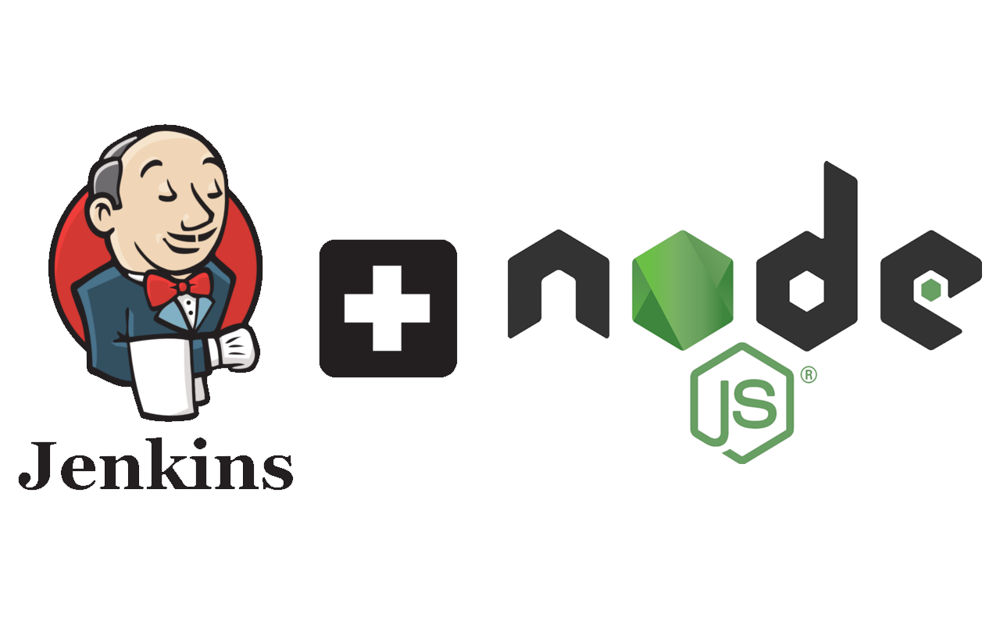
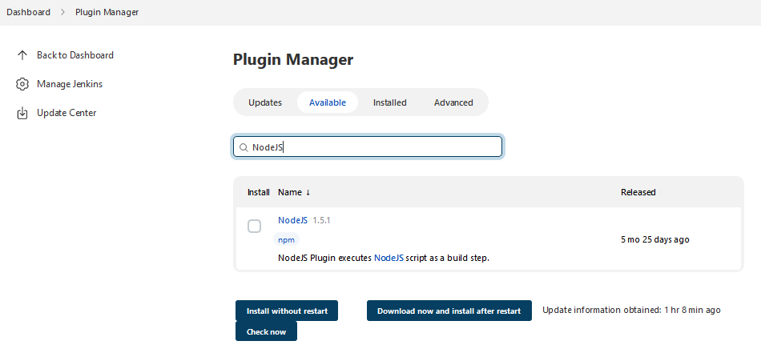
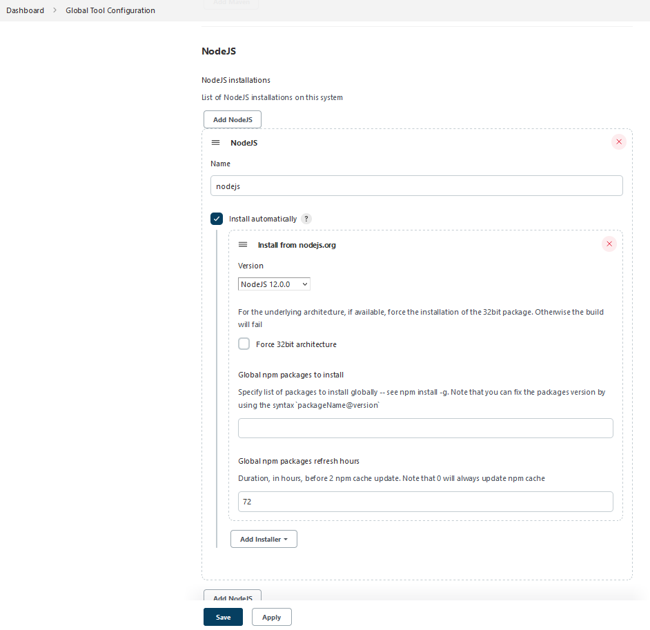
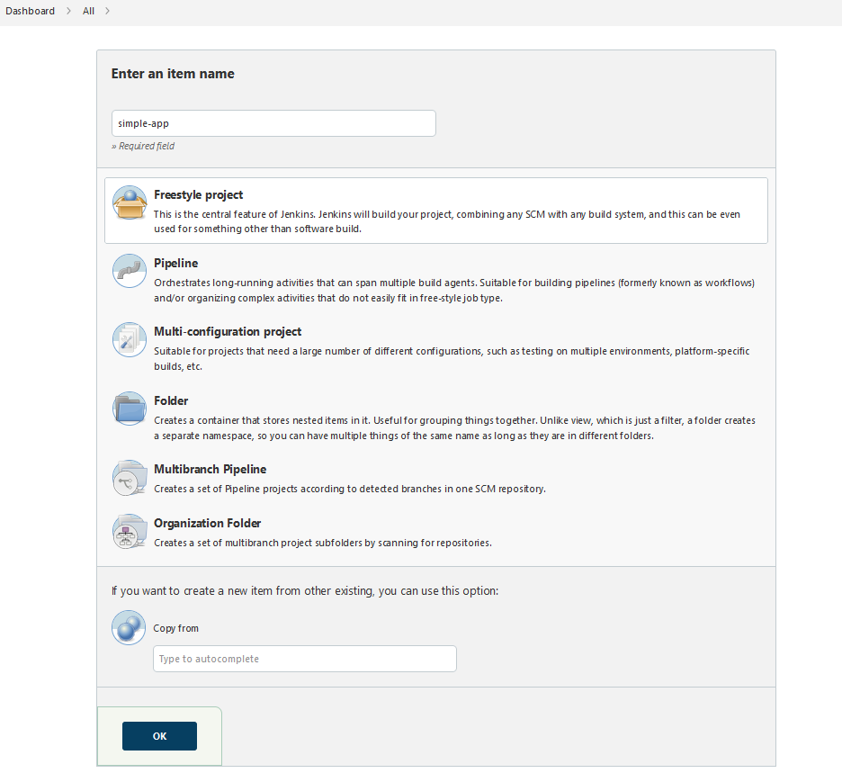
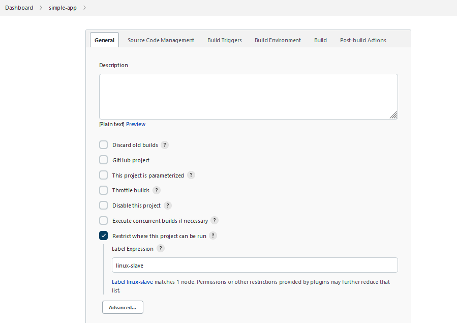
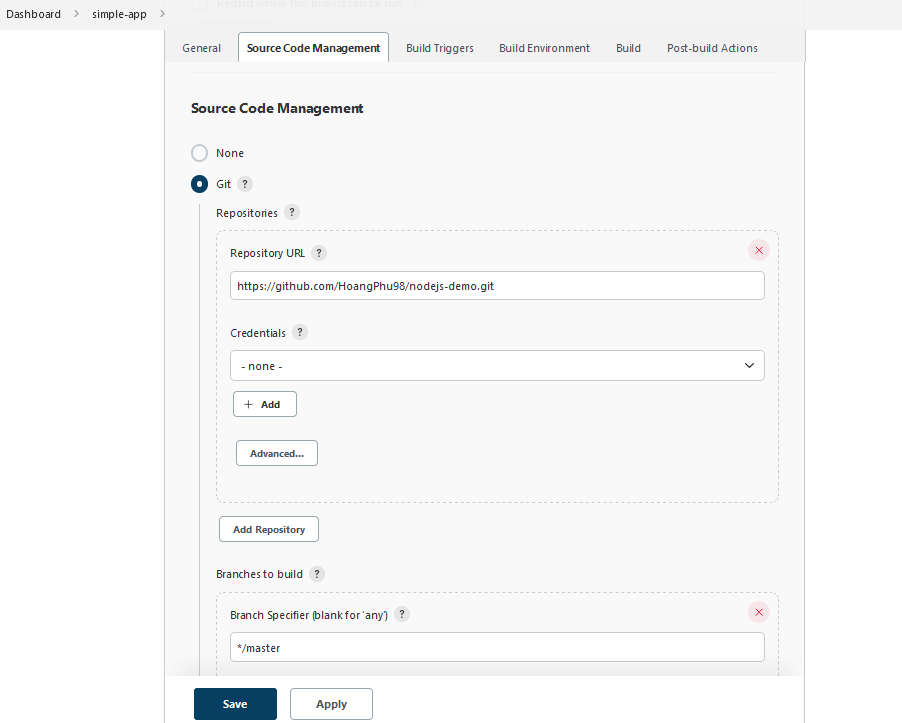
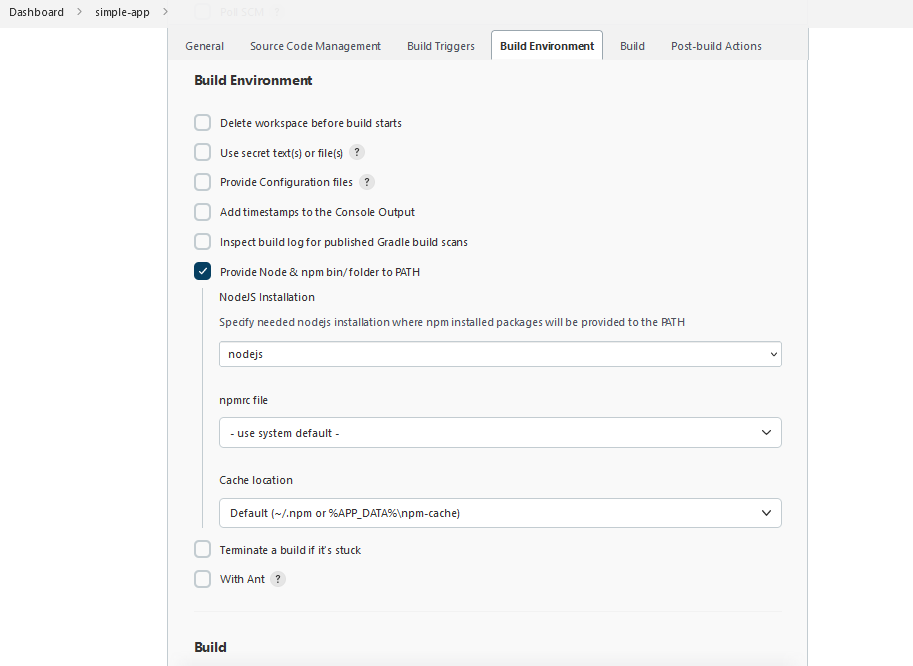
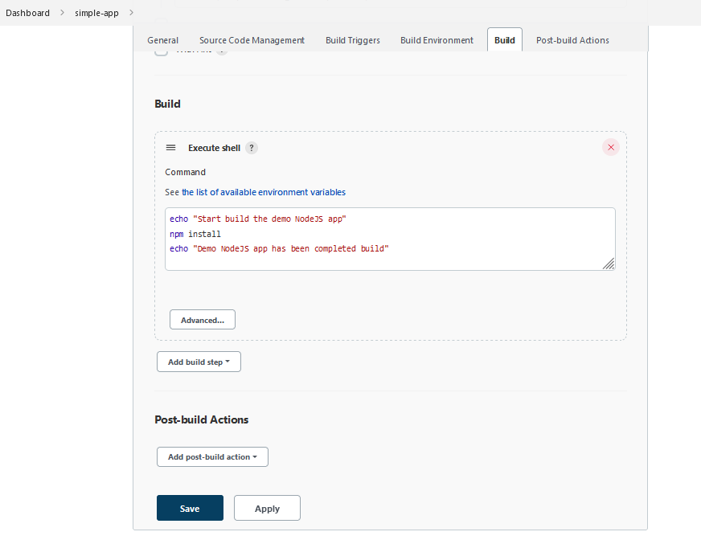
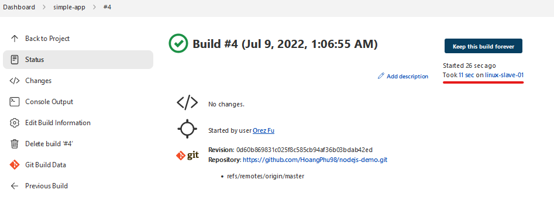
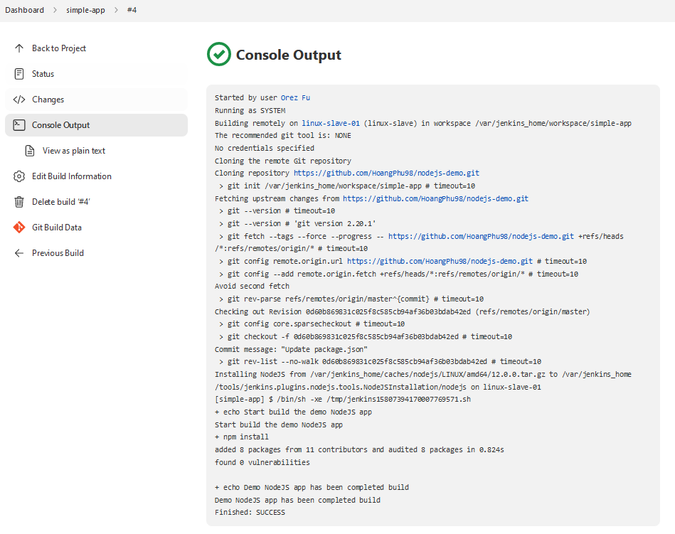

# Jenkins Architecture - Task 2

## Task #2

Trong task này, bạn được yêu cầu:

- Build một một nodejs webapp đơn giản
- Cấu hình Freestyle Project để job chạy trên Jenkins Slaves

## 1. Cài đặt NodeJS plugin và npm

### 1.1.  Cài đặt NodeJS plugin  

- Vào mục **Manage Jenkins** => **Manage Plugins** => Chọn Tab **Available** và tìm **NodeJS** plugin.  
- Chọn **Install without Restart** và cài đặt.  

  
### 1.2.  Cấu hình NodeJS plugin

- Vào mục **Manage Jenkins** => **Global Tool Configuration** => Tại phần **NodeJS** chọn **Add NodeJS** và chọn phiên bản **nodejs 12.0.0**  

## 2. Tạo Jenkins job  

- Chọn **New Item** và chọn **Freestyle project** đặt tên cho project và click **OK**  

  

- Trong phần **General**, tích chọn **Restrict where this project can be run**, nhập vào label của Jenkins Slave

  

- Trong phần **Source Code Management** chọn tới link github của sample project  

  

- Trong phần **Build Environment** chọn **Provide Node & npm bin/ folder to PATH** chọn NodeJS Installation cài đặt ở bước **#1.2**  

- Trong phần **Build** chọn **Add build step** => chọn **Execute Shell**.  Trong phần nội dung của Shell điền command build `npm install`  

  

## 3. Build job  

Click **Build  Now** và kiểm tra kết quả của quá trình build.

- Trong trạng thái của `job`, xác nhận node thực hiện Job Build

- Kết quả log của Job Build

**Task #2 Completed**
